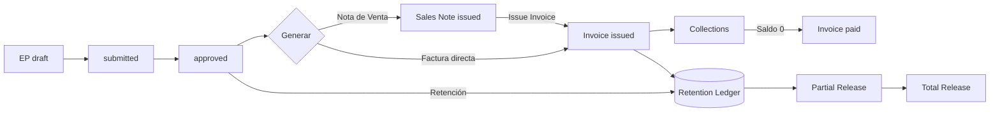

# ofitec.ai


> Dashboard HTML rápido: abre `badges/ar_rules_dashboard.html` (se genera en cada run) para ver JSON actual, weekly agg y últimas filas de historial en una sola página.

Frontend (Next.js 15) en 3001 y Backend (Flask) en 5555. Datos en `data/chipax_data.db`.
Todas las decisiones se alinean a `docs/docs_oficiales/` (Ley de Puertos, Ley de BD, Estrategias y Mapeos).

## AI (Resumen rápido)

Endpoints experimentales para análisis asistido:

- `POST /api/ai/summary` genera un resumen financiero usando últimos eventos AP/AR (con caché y rate limiting).
- `POST /api/ai/ask` pregunta libre sobre un contexto ligero.
- `POST /api/ai/ask/async` + `GET /api/ai/jobs/<id>` flujo asíncrono.

Características: trimming de contexto, caché TTL, rate limiting in‑memory, métricas Prometheus (`ai_endpoint_calls_total`, `ai_endpoint_latency_seconds`).

Documentación completa: [docs/AI_ENDPOINTS.md](docs/AI_ENDPOINTS.md)


## Resumen Rápido: AP ↔ PO Matching

Módulo que sugiere y valida vínculos entre facturas de compra (AP) y líneas de OC (PO):

- Endpoints principales: `/api/ap-match/suggestions`, `/preview`, `/confirm`, `/feedback`, `/invoice/<id>`, `/config`.
- Algoritmo: selección greedy de subconjuntos + scoring (delta monto, vendor match) dentro de tolerancia.
- Validaciones: monto/qty restante, tolerancias (%), recibo requerido (3‑way-lite), sobre‑asignación.
- Tolerancias con precedencia: defaults < global < proyecto < proveedor.
- Feedback opcional persiste eventos para futura mejora de pesos.
- Migración de esquema soportada (script: `tools/migrate_ap_match_schema.py`).

Documentación completa: [docs/MATCHING.md](docs/MATCHING.md)

## Resumen: Estados de Pago (EP)

Módulo para gestionar avances de contratos cliente (EP) y su ciclo financiero:

- Tablas núcleo: contratos (`client_contracts`), SOV (`client_sov_items`), EP (`ep_headers`, `ep_lines`, `ep_deductions`), AR (`ar_invoices`, `ar_collections`), staging (`ep_import_staging`), retenciones (`ep_retention_ledger`).
- Flujo: `draft -> submitted -> approved -> invoiced -> paid`.
- Validaciones: topes SOV, duplicado de factura, neto cero, cobro excedido, violaciones en staging.
- Import Staging: heurística de mapeo de columnas y promoción a EP validado.
- Retención: cálculo sugerido y ledger para liberar en el futuro (parcial y total liberación soportadas).
- Nota de Venta (Sales Note): capa opcional previa a la factura para separar aprobación técnica de emisión tributaria.
- Métricas integradas en `/api/projects/overview` y `/api/finance/overview` (approved_net, pending_invoice, expected_inflow, actual_collections).

Detalle completo: [docs/ESTADO_PAGO.md](docs/ESTADO_PAGO.md)

Errores y convenciones de payload: [API_ERROR_CODES.md](API_ERROR_CODES.md)

Flujo EP → Nota de Venta → Factura → Cobranza mostrado en Quickstart (ver `QUICKSTART.md` cuando se agregue).

### Diagrama Flujo Comercial EP



## Estructura

- `frontend/`  (Next.js)
- `backend/`   (Flask API)
- `services/conciliacion_bancaria/` (servicio independiente; usar como submódulo)
- `data/`      (base de datos local, no se versiona)
- `docs/`      (docs oficiales)

## Puertos oficiales

- Frontend: <http://localhost:3001>
- Backend:  <http://localhost:5555>

### Health Check

- Backend: <http://localhost:5555/api/health> (usado en healthchecks de Docker).
- Frontend: <http://localhost:3001/api/health> (respuesta JSON `{ "status": "ok" }`).

## Primeros pasos

0. Copiar `.env.example` a `.env` y ajustar variables según tu entorno (backend, frontend y Postgres opcional).
1. Crear la base canónica (tablas + vistas) en dev:
   - `python tools/apply_schema.py --db data/chipax_data.db --schema tools/schema.sql`
   - (Alternativa solo Finanzas) `python tools/create_finance_views.py --db data/chipax_data.db`
2. Configurar `backend/.env` si deseas anular defaults:
   - `DB_PATH=../data/chipax_data.db`
   - `PORT=5555`
   - `CORS_ORIGINS=http://localhost:3001`
3. Iniciar con Docker Compose:
   - `docker-compose up --build` (usa `docker-compose.override.yml` para activar Postgres y healthchecks automáticos).
4. Endpoints principales:
   - `/api/projects`, `/api/providers`, `/api/financial`, `/api/finanzas/facturas_compra`, `/api/finanzas/cartola_bancaria`
   - EP / Estado de Pago: `/api/ep`, `/api/ep/<id>`, `/api/ep/<id>/lines/bulk`, `/api/ep/<id>/approve`, `/api/ep/<id>/generate-sales-note`, `/api/sales-notes/<sid>/issue-invoice`, `/api/ep/<id>/generate-invoice`, `/api/ep/<id>/retention/release`.
   - AP Matching: `/api/ap-match/...`
   - AR (cobranzas): `/api/ar/invoices/<id>`, `/api/ar/collections` (depende de implementación actual).
5. Frontend consume `NEXT_PUBLIC_API_BASE` (ya seteado en compose).

## Modo de Trabajo Local (histórico) vs CI Actual

Originalmente el proyecto operaba 100% en modo local (sin remoto / sin pipelines) para maximizar velocidad. Ese contexto se mantiene como referencia histórica, pero actualmente existe un workflow de GitHub Actions que ejecuta tests, quality gates y (opcionalmente) performance & stress.

Principios que se conservan localmente:

- Respaldos manuales (`scripts/backup_local.ps1`).
- Guard opcional del stub de conciliación: `python scripts/guard_conciliacion_stub.py` (ya poco necesario tras estabilizar el blueprint limpio).
- Formato y lint manual (`npm run format`, `npm run lint`).

Cambios con la introducción de CI:

- Workflow `.github/workflows/tests.yml` con jobs modulares.
- Quality gates sobre ratios y latencia.
- Tests de stress y performance opt‑in vía dispatch inputs.

Uso aislado (sin GitHub): simplemente ignora el workflow y ejecuta comandos locales como antes.

## Tests rápidos (contratos API + Pytest nuevos)

Sin dependencias extra (unittest):

Unittest legado:

```bash
python -m unittest discover -s backend/tests -v
```

Pytest (nuevos flujos: staging EP, sales notes, collections, retention multi):

```bash
python -m pytest -q
```

Tests destacados:

- `test_ep_staging_happy_path.py`
- `test_sales_note_flow.py`
- `test_ar_collections_flow.py`
- `test_ap_match_feedback_only.py`
- `test_ep_retention_multi_integration.py`

### Coverage (backend)

Script helper PowerShell:

```bash
pwsh scripts/coverage_pytest.ps1
```

Para incluir HTML:

```bash
pwsh scripts/coverage_pytest.ps1 -Html
```

El reporte HTML queda en `htmlcov/`.

## CI Automatizado & Quality Gates

Workflow principal: `.github/workflows/tests.yml` (trigger: push, pull_request, workflow_dispatch).

| Job | Propósito | Siempre | Opt‑In |
|-----|-----------|---------|--------|
| core | Suite estándar (funcional + unit) | Sí | - |
| quality-thresholds | Enforce `failure_ratio`, `drop_ratio` | Sí | - |
| perf | Benchmark p95 conciliación | No | `run_perf` |
| stress | Saturación cola async / `drop_ratio` | No | `run_stress` |

### Inputs del Workflow (dispatch)

- `run_perf` (bool, default false)
- `run_stress` (bool, default false)
- `perf_budget_ms` (int, default 120)
- `max_failure_ratio` (float, default 0.15)
- `max_drop_ratio` (float, default 0.25)

Variables de entorno derivadas: `PERF_P95_BUDGET_MS`, `MAX_FAILURE_RATIO`, `MAX_DROP_RATIO`.

### Métricas controladas

- `failure_ratio` = errores / emitidos
- `drop_ratio` = dropped / intentos
- `p95_latency_ms` (solo job perf)

Si un límite se excede el job falla temprano, evitando merges regresivos.

### Marcadores Pytest

- `@pytest.mark.perf`
- `@pytest.mark.stress`

Ejecución local selectiva:

```bash
python -m pytest -m perf -q
python -m pytest -m stress -q
```

PowerShell helper:

```bash
pwsh scripts/test_select.ps1 -Markers perf
pwsh scripts/test_select.ps1 -Markers stress
```

### Artefacto de Performance

`PERF_BASELINE_JSON=perf_result.json` hace que el benchmark exporte un JSON (samples, p95_ms, avg_ms, slo_budget_ms) para publicar como artifact.

En el workflow se sube con el nombre de artifact `perf-baseline-json` y archivo `perf_result.json`. Puede descargarse desde la pestaña *Actions* para comparar historiales o generar badges.

### Historial de Performance

Además se genera/actualiza `perf_history.csv` (artifact `perf-history`) acumulando filas:

```text
timestamp,iterations,mean_ms,p95_ms,budget_ms
2025-09-20T12:34:56Z,60,11.8,33.5,120
```

Esto permite análisis de regresión temporal fuera del repositorio.

### Badge de Estado

El badge al inicio del README apunta al workflow `tests.yml` y refleja el estado del último run en branch principal.

### Job Lint/Format

Se añadió job `lint-format` que ejecuta `npm run format:check` y luego `npm run lint` (frontend). Si hay diferencias de formato, el job falla para incentivar formatear antes de merge.

### Cobertura Backend

El job `core` ahora genera `coverage.xml` y aplica un umbral mínimo configurable vía input `min_coverage` (default 70). Si la cobertura (line-rate global) cae por debajo, el job falla.

Artifacts:
 
- `coverage-backend`: incluye `coverage.xml` y `.coverage` (para análisis externo o subir a servicios de cobertura si se desea en el futuro).
 

Puedes lanzar el workflow manual con un umbral distinto, por ejemplo 75%, ajustando `min_coverage` en `workflow_dispatch`.

### Futuras extensiones sugeridas

- Badge dinámico de p95 y ratios leyendo el último artifact.
- Historial acumulado de benchmarks para detectar regresiones de tendencia.
- Job opcional de lint/format (si se reintroducen hooks estrictos).

---

## Scripts útiles

- `scripts/dev_compose_rebuild.ps1`: Rebuild y arranque de contenedores sin caché.
- `scripts/dev_rebuild_and_smoke.ps1`: Rebuild + smoke para SC EP.
- `scripts/smoke_sc_ep.ps1`: Prueba rápida del cálculo de Estado de Pago.
- `scripts/smoke_sc_ep.py`: Versión Python del smoke SC EP.
- `scripts/smoke_ar_map.ps1`: Smoke del endpoint de sugerencias AR.
- `scripts/smoke_ar_auto_assign.ps1`: Smoke del auto-asignador AR (usa `-DryRun` por defecto en la tarea).
- `scripts/promote_ar_rules.ps1`: Promueve reglas de mapeo AR aprendidas. Usa `-DryRun` para previsualizar.

## Promoción de Reglas AR (Automatizada / Manual)

Existe un workflow opcional de GitHub Actions para promover patrones frecuentes de asignación de proyectos en cuentas por cobrar (AR) a reglas persistentes en `ar_project_rules`.

Archivo: `.github/workflows/ar-promote-rules.yml`

### ¿Qué hace?

1. Ejecuta un dry‑run de `tools/promote_ar_rules.py` para mostrar cuántos pares `customer_name -> project_id` se detectan y cuántas reglas se crearían.
2. (Opcional) Ejecuta la promoción real (inserciones) si `dry_run_only` es `false`.
3. Publica artefactos: `promote_dry_run.json` y `promote_real_run.json` (si corresponde) y un resumen en el job Summary.

### Inputs (workflow_dispatch)

| Input | Default | Descripción |
|-------|---------|-------------|
| `min_count` | `3` | Frecuencia mínima para promover un patrón (nombre cliente + proyecto dominante). |
| `dry_run_only` | `false` | Si `true`, se salta la promoción real y sólo genera salida dry‑run. |

### Ejecución Manual

1. Ir a pestaña *Actions* → *AR Project Rule Promotion (Optional)*.
2. Click en *Run workflow* → ajustar inputs → *Run*.
3. Ver resultados en: Summary del job y artefactos descargables.

### Habilitar Ejecución Programada

El bloque `schedule` está comentado. Para ejecución diaria por ejemplo a las 03:17 UTC:

```yaml
schedule:
   - cron: '17 3 * * *'
```

Después de editar, haz commit y push; GitHub activará la programación.

### Script Local (sin CI)

Dry‑run:

```bash
python tools/promote_ar_rules.py --db data/chipax_data.db --min-count 3 --dry-run
```

Real:

```bash
python tools/promote_ar_rules.py --db data/chipax_data.db --min-count 3
```

PowerShell helper:

```powershell
pwsh scripts/promote_ar_rules.ps1 -MinCount 3 -DryRun
pwsh scripts/promote_ar_rules.ps1 -MinCount 3
```

### Notas y Seguridad

- El workflow CI opera sobre el SQLite del repo (`data/chipax_data.db`). Si necesitas promover reglas contra una base productiva, deberás montar/copiar ese snapshot antes (por ejemplo descargando un artifact o usando un secret para fetch remoto). El workflow actual **no** contiene lógica para bases externas.
- Las reglas creadas son de tipo `customer_name_like` (patrón exacto). Para patrones regex o heurísticos más avanzados deben agregarse manualmente (o ampliar el script).
- Idempotencia: El script evita duplicar una regla existente con el mismo `pattern` y `project_id`.
- Observa el campo `learned_pairs` en la salida: si es 0 significa que hoy no hay suficiente data confirmada para generar nuevas reglas.
- Puedes ajustar `--min-count` en ejecuciones manuales para experimentar (ej. bajar a 2 en entornos de prueba con poco volumen). Evita usar valores muy bajos en producción (ruido / overfitting).

### Extensiones Futuras (ideas)

- Soporte para generar reglas `alias_regex` basadas en clustering de nombres.
- Métrica Prometheus de cobertura de reglas nuevas (ej. `% de facturas futuras directamente clasificadas`).
- Notificación (Slack / Teams) con diff de reglas promovidas.
- Integración de badge AR Rules directo vía GitHub Pages (opcional) si se desea exponer fuera del repo.

#### Endpoint de Estadísticas AR

Ahora disponible: `GET /api/ar/rules_stats` devuelve JSON con:

```jsonc
{
  "rules_total": 0,
  "rules_by_kind": {"customer_name_like": 0},
  "invoices_total": 0,
  "invoices_with_project": 0,
  "project_assign_rate": null,
  "distinct_customer_names": 0,
  "customer_names_with_rule": 0,
  "customer_name_rule_coverage": null,
  "recent_events_30d": 0,
  "generated_at": "2025-09-20T12:00:00Z"
}
```

Prometheus export: agrega gauges `matching_ar_customer_name_rule_coverage` y otros en `/api/matching/metrics/prom`.

##### Alerta de Caída en Asignación de Proyecto (Badge Workflow)

El workflow diario `ar-rules-stats.yml` compara el `project_assign_rate` actual contra el del run anterior.

- Umbral: caída > 5 puntos porcentuales (pp) genera archivo `badge_drop_alert.txt` y se muestra en el Summary del job.
- Persistencia: el último JSON se copia como `badges/prev_ar_rules_stats.json` tras cada ejecución exitosa.
- Metadata adicional: `badges/drop_meta.json` con `{ prev, cur, drop_fraction, drop_pp }` para auditoría.
- No falla el workflow (soft alert); se puede endurecer haciendo `exit 1` dentro del paso si se desea bloquear merges.

Nueva opción en el dispatch manual:

| Input | Default | Descripción |
|-------|---------|-------------|
| `fail_on_drop_pp` | (vacío) | Si se indica (ej. `6`), el workflow falla si la caída en `project_assign_rate` ≥ ese número de puntos porcentuales. Vacío = modo sólo alerta. |
| `fail_on_cov_drop_pp` | (vacío) | Igual que anterior pero aplicado a `customer_name_rule_coverage`. |
| `fail_on_streak` | (vacío) | N días consecutivos de caída simultánea en assign y coverage (ambos descienden estrictamente). Si se especifica y se detecta, falla. |

Histórico: cada ejecución agrega una línea a `badges/ar_rules_history.csv`:

```csv
timestamp,project_assign_rate,customer_name_rule_coverage
2025-09-20T05:00:05Z,0.82,0.76
```

Esto permite graficar tendencia (importar el CSV en un panel externo o script futuro para generar badge de evolución).

Badge de tendencia: `badges/ar_rules_trend.svg` muestra promedios simples (últimos ≤7 registros) de asignación y cobertura.

Alertas adicionales:

- Cobertura: `cov_drop_alert.txt` y metadata `cov_drop_meta.json` análogo a assign.
- Racha descendente: archivo `streak_alert.txt` si hay N días (input `fail_on_streak`) con descenso continuo en ambos indicadores.

Salidas adicionales recientes:

- `badges/ar_rules_coverage_only.svg`: Badge dedicado de cobertura de reglas por nombre de cliente.
- `badges/ar_rules_trend_wma.svg`: Badge con media móvil ponderada (WMA) lineal (pesos 1..N, N=7 por defecto) para asignación y cobertura (texto `assign X% | cov Y%`). Suaviza ruido diario y da mayor peso a días recientes.
- `badges/ar_rules_weekly.json`: Agregación rolling (default 7 filas recientes) con min/max/avg de `project_assign_rate` y `customer_name_rule_coverage`. Permite construir panel externo o detectar variabilidad.

Ejemplo `ar_rules_weekly.json`:

```json
{
   "window_size": 7,
   "rows": 7,
   "assign_min": 0.74,
   "assign_max": 0.82,
   "assign_avg": 0.7871,
   "coverage_min": 0.68,
   "coverage_max": 0.77,
   "coverage_avg": 0.7314
}
```

Notificaciones (Slack / Teams):

Si existen alertas (`badge_drop_alert.txt`, `cov_drop_alert.txt`, `streak_alert.txt`) el workflow intentará publicar un mensaje consolidado a los webhooks definidos vía secrets:

| Secret | Descripción |
|--------|-------------|
| `SLACK_WEBHOOK_URL` | Incoming Webhook Slack (JSON `{text: ...}`) |
| `TEAMS_WEBHOOK_URL` | Incoming Webhook Microsoft Teams |

Si no se definen los secrets simplemente se omite el envío (log: `No alerts to notify` o `Alerts detected, attempting notifications`).

Extensiones futuras sugeridas:

- Ajustar umbral dinámico (p.ej. >3pp si `prev` < 40%).
- Graficar histórico leyendo los JSON de stats como serie temporal.
- Badge de volatilidad (desviación estándar 7d) para priorizar investigación cuando aumenta la dispersión.

### Nuevas extensiones implementadas

Desde la última iteración se añadieron varias mejoras al workflow `ar-rules-stats.yml`:

1. Umbrales Dinámicos (`dynamic_threshold_mode`):
   - Input nuevo en el dispatch manual: `dynamic_threshold_mode` (`off|sensitive|lenient`).
   - Calcula thresholds adaptativos (puntos porcentuales de caída permitida) basados en el valor previo:
     - `sensitive`: si `prev < 40%` → 3pp, `<60%` → 4pp, else 5pp.
     - `lenient`: si `prev < 40%` → 6pp, `<60%` → 7pp, else 8pp.
     - `off` (default) mantiene 5pp (estático). Si se proporcionan inputs explícitos `fail_on_drop_pp` / `fail_on_cov_drop_pp` estos tienen prioridad sobre el modo dinámico.
2. Badge WMA (`ar_rules_trend_wma.svg`): media móvil ponderada (pesos lineales) para asignación y cobertura – ya mencionado arriba pero ahora integrado al dashboard.
3. Weekly Aggregation JSON (`ar_rules_weekly.json`): min/max/avg rolling ventana configurable (default 7 filas) para análisis de rango y estabilidad.
4. Badge de Volatilidad (`ar_rules_volatility.svg`): muestra desviación estándar (sample, ventana 7) en puntos porcentuales para asignación y cobertura (`sd assign X.Ypp | cov Z.Wpp`). Colores según volatilidad de asignación:
   - <2pp verde (#2ECC71)
   - <4pp amarillo (#F1C40F)
   - <6pp naranja (#E67E22)
   - ≥6pp rojo (#E74C3C)
5. Dashboard HTML (`ar_rules_dashboard.html`): página estática que embebe badges, JSON actual, weekly aggregation y últimas N filas (default 30). Sin dependencias externas → se puede abrir directamente desde GitHub (vista raw) o servir vía Pages.
6. Script de Historia Sintética (`tools/gen_ar_rules_fake_history.py`): genera un CSV de historial plausible para experimentar localmente con los badges sin esperar múltiples días.

#### Uso rápido: Historia Sintética

Ejemplos para poblar `badges/ar_rules_history.csv`:

```bash
python tools/gen_ar_rules_fake_history.py --out badges/ar_rules_history.csv               # 30 días modo estable
python tools/gen_ar_rules_fake_history.py --out badges/ar_rules_history.csv --days 60 --mode improving --seed 42
python tools/gen_ar_rules_fake_history.py --out badges/ar_rules_history.csv --mode volatile --append
```

Modos soportados: `stable`, `improving`, `declining`, `volatile`. Ajustan drift y ruido. Formato resultante coincide con el producido por el workflow real, por lo que inmediatamente se pueden regenerar badges localmente:

```bash
python tools/gen_ar_rules_trend_badge.py --history badges/ar_rules_history.csv --out badges/ar_rules_trend.svg
python tools/gen_ar_rules_wma_badge.py --history badges/ar_rules_history.csv --out badges/ar_rules_trend_wma.svg
python tools/gen_ar_rules_volatility_badge.py --history badges/ar_rules_history.csv --out badges/ar_rules_volatility.svg
python tools/gen_ar_rules_weekly_agg.py --history badges/ar_rules_history.csv --out badges/ar_rules_weekly.json
python tools/gen_ar_rules_dashboard.py --stats badges/ar_rules_stats.json --history badges/ar_rules_history.csv --weekly badges/ar_rules_weekly.json --out badges/ar_rules_dashboard.html
```

#### Resumen Rápido de Artefactos AR

| Archivo / Badge | Propósito |
|-----------------|-----------|
| `ar_rules_coverage.svg` | Asignación vs Cobertura instantánea (principal) |
| `ar_rules_coverage_only.svg` | Cobertura de reglas por nombre cliente |
| `ar_rules_trend.svg` | Promedio simple 7d (assign & coverage) |
| `ar_rules_trend_wma.svg` | Media móvil ponderada 7d (más peso a días recientes) |
| `ar_rules_volatility.svg` | Desviación estándar 7d (pp) asignación/cobertura |
| `ar_rules_volatility.json` | Volatilidad numérica (std dev fraccional y en pp) + percentiles p10/p90, rango (p90-p10) e IQR (p75-p25) para asignación y cobertura |
| `ar_rules_thresholds.svg` | Badge de thresholds dinámicos actuales (si modo != off) |
| `ar_rules_weekly.json` | min/max/avg ventana reciente (default 7 filas) |
| `ar_rules_sparkline.svg` | Mini serie temporal (últimos N valores) con polylines asignación (verde) y cobertura (morado) |
| `ar_rules_streak.svg` | Racha actual (↑ / ↓ / sin) y longitud para asignación y cobertura (colores: rojo caída ≥3, verde subida ≥3) |
| `ar_rules_dashboard.html` | Vista combinada (badges + JSON + historial) |
| `ar_rules_history.csv` | Serie temporal cruda (append diario o sintética) |
| `prev_ar_rules_stats.json` | Último snapshot para detección de caídas |
| `drop_meta.json` / `cov_drop_meta.json` | Metadata de caída detectada |
| `badge_drop_alert.txt` / `cov_drop_alert.txt` / `streak_alert.txt` | Alertas generadas (si aplica) |

Para activar thresholds dinámicos en un run manual: seleccionar workflow → *Run workflow* → `dynamic_threshold_mode: sensitive` (u `lenient`).

#### Nuevos inputs de seeding (sólo para experimentación)

El workflow ahora acepta inputs opcionales para generar un bloque de historia sintética antes de agregar la fila del día real. Útil para poblar un repo recién clonado o probar badges sin esperar días reales.

| Input | Default | Descripción |
|-------|---------|-------------|
| `seed_fake_history` | `false` | Si `true`, genera historial sintético previo al append diario. |
| `seed_days` | `30` | Número de días sintéticos a crear. |
| `seed_mode` | `stable` | Patrón de evolución (`stable`, `improving`, `declining`, `volatile`). |
| `seed_seed` | (vacío) | Semilla RNG para reproducibilidad (ej. `42`). |

Ejemplo run manual rápido (poblar + métricas reales del día):

```text
seed_fake_history: true
seed_days: 45
seed_mode: improving
seed_seed: 123
```

La generación crea/reescribe `badges/ar_rules_history.csv` antes de que el paso normal agregue la fila del día actual. No usar en entornos productivos (sólo exploración / demos).


---

## Herramientas

- `backend/reconcile_engine.py`: heurística híbrida (reglas + fuzzy) para sugerencias de conciliación y evidencias.
- `tools/import_chipax_ar.py`: Importa CSV de Chipax (AR) a `data/chipax_data.db`.
- `tools/create_finance_views.py`: Construye/actualiza vistas financieras de apoyo.
- `tools/promote_ar_rules.py`: Batch que aprende y crea reglas `ar_project_rules`.

## Convenciones de Código y Estilo

Se aplican reglas de formato y lint estrictas para asegurar consistencia.

### Formato (Prettier)

- Configuración en `frontend/.prettierrc` (ancho 100, comillas simples, trailing commas `all`).
- Ejecutar para formatear: `npm run format`.
- Verificar sin modificar: `npm run format:check`.

### Lint (ESLint)

- Script: `npm run lint` (usa ESLint CLI directamente, no `next lint` deprecado).
- Reglas extendidas: `next/core-web-vitals` + `plugin:prettier/recommended`.
- Regla `prettier/prettier` se marca como error (bloquea commit si no se formatea).
- Variables no usadas deben eliminarse o renombrarse con prefijo `_`.

### Hooks (Desactivados)

Anteriormente se usaba Husky + lint-staged; fueron removidos para simplificar. Ejecutar manualmente:

- Formato: `npm run format`
- Lint: `npm run lint`

### Estandarización Editor

- `.editorconfig` fuerza `lf`, UTF-8 e indentación de 2 espacios.

### Banner TypeScript

- Puede aparecer un banner de soporte de `@typescript-eslint` (<5.4.0). Actualmente usamos TS 5.9.x que funciona; ignorar mientras no haya issues.

### Flujo sugerido de guardado local

1. Escribe código
2. Ejecuta `npm run format` y `npm run lint`
3. Crea un respaldo: `pwsh scripts/backup_local.ps1 -IncludeCode`
4. (Opcional) Sincroniza manualmente la carpeta `backups/` a un almacenamiento externo.

## Respaldos Locales

Script: `scripts/backup_local.ps1`

Ejemplos:

- Respaldo rápido (solo DB):
  - `pwsh scripts/backup_local.ps1`
- Respaldo incluyendo código (zip backend + frontend):
  - `pwsh scripts/backup_local.ps1 -IncludeCode`
- Conservar 14 últimos respaldos:
  - `pwsh scripts/backup_local.ps1 -IncludeCode -Keep 14`

Estructura del respaldo:

```text
backups/
   20240918_101530/
      data/
         chipax_data.db
      codigo.zip (si -IncludeCode)
```

Rotación: se conservan los N más recientes (`-Keep`, default 7).

## Auto-Confirmación (responder automáticamente "sí" a prompts)

En algunos flujos (instalaciones, migraciones, regeneraciones) necesitamos contestar repetidamente "y" / "yes" a prompts interactivos. Para acelerar pruebas locales se añadieron varios scripts multi‑plataforma que automatizan esta interacción. Úsalos con cuidado: aceptar todo a ciegas puede provocar sobre‑escrituras o ejecuciones peligrosas.

### Opciones disponibles

| Script | Plataforma | Uso principal | Notas de seguridad |
|--------|------------|---------------|--------------------|
| `scripts/yes.sh` | Bash (WSL / Git Bash) | Generar un stream infinito del token (default `y`) | No inspecciona la salida; siempre responde `y`. |
| `scripts/yes.ps1` | PowerShell | Equivalente a `yes.sh` en entorno Windows nativo | Igual que anterior; se puede parametrizar con `-Token`. |
| `scripts/auto_yes.js` | Node.js | Responder sólo cuando se detecta un prompt (heurística) | Detecta patrones tipo `? (y/N)` / `Overwrite` / `Replace` / `Proceed`; reduce respuestas erróneas. |
| `scripts/auto_yes.py` | Python (pexpect) | Matching robusto de prompts interactivos | Requiere librería `pexpect` (`pip install pexpect`). |
| `scripts/whitelisted_yes.sh` | Bash | Sólo permite auto‑confirmar comandos benignos (lista blanca) | Rechaza comandos fuera de la whitelist para mitigar abuso. |

### Ejemplos de uso rápido

Siempre revisa primero el comando que vas a automatizar.

```bash
# Bash / WSL
bash scripts/yes.sh | <comando_que_pide_confirmacion>

# Forzar token distinto (ej: "yes")
Y_TOKEN=yes bash scripts/yes.sh | <comando>

# PowerShell (Windows)
pwsh scripts/yes.ps1 | <comando>
pwsh scripts/yes.ps1 -Token yes | <comando>

# Node (responde sólo si detecta prompt)
node scripts/auto_yes.js -- <comando>

# Python robusto (regex, timeout configurable)
python scripts/auto_yes.py -- <comando>

# Whitelist (ej: instalar dependencias sin escribir en rutas peligrosas)
bash scripts/whitelisted_yes.sh "npm install"
bash scripts/whitelisted_yes.sh "pip install -r requirements.txt"
```

### ¿Cuándo usar cada uno?

- Rápido y simple (entorno controlado): `yes.sh` / `yes.ps1`.
- Quieres evitar responder "y" donde no corresponde: `auto_yes.js`.
- Necesitas mayor control (timeouts, logging detallado): `auto_yes.py`.
- Necesitas una barrera de seguridad adicional: `whitelisted_yes.sh`.

### Parámetros y variables

| Herramienta | Parámetros / Vars | Descripción |
|-------------|-------------------|-------------|
| `yes.sh` | `Y_TOKEN` env | Token a repetir (default `y`). |
| `yes.ps1` | `-Token <str>` | Token a repetir (default `y`). |
| `auto_yes.js` | `--delay-ms <n>` | Delay antes de responder (default 50ms). |
| `auto_yes.py` | `--timeout <s>` | Timeout global ejecución (default 0 = sin). |
| `auto_yes.py` | `--expect-regex <r>` | Regex personalizada para prompts (repite). |
| `whitelisted_yes.sh` | `ALLOWED_CMDS` env | Lista (separada por `\|`) de comandos permitidos. |

### Seguridad y buenas prácticas

1. Nunca combines estos scripts con comandos destructivos (`rm -rf`, migraciones productivas, alteraciones irreversibles) sin supervisión.
2. Prefiere `auto_yes.js` / `auto_yes.py` sobre la versión básica para reducir respuestas falsas positivas.
3. Usa `whitelisted_yes.sh` en pipelines donde quieras garantizar que sólo ciertos comandos reciben respuestas automáticas.
4. Añade logs / `set -x` en entornos CI para auditar qué comandos fueron auto‑confirmados.
5. Si un proceso se queda colgado, cancela y ejecuta manualmente para inspeccionar el prompt real (posible regex faltante).

### Instalación de dependencias (sólo Python)

El script `auto_yes.py` requiere `pexpect`:

```bash
pip install pexpect
```

Puedes opcionalmente añadirlo a un requirements de herramientas internas si se extiende su uso.

### Extensiones futuras sugeridas

- Flag `--dry-run` en `auto_yes.js` para loggear prompts detectados sin responder.
- Modo JSON log (`--log-json`) para auditoría en CI.
- Integrar lista negra (palabras que cancelan en lugar de confirmar).

---

## Health Check de la Base de Datos

Script: `python tools/data_health_check.py`

Propósito: entregar una visión rápida del estado de la BD SQLite (`chipax_data.db`):

- Tablas y vistas núcleo presentes o faltantes
- Conteo de filas por tabla y rango de fechas (columna detectada: `fecha`, `invoice_date`, `po_date`)
- Índices sugeridos (heurística sobre columnas frecuentes de búsqueda)
- Fragmentación (freelist ratio) y recomendación de `VACUUM`
- Necesidad de `ANALYZE` (estadísticas ausentes)
- Resultado de `PRAGMA integrity_check`

Ejemplos:

```bash
python tools/data_health_check.py
python tools/data_health_check.py --json > health_report.json
```

Interpretación rápida:

- `freelist ratio > 0.2` y >5000 filas totales: considerar `VACUUM`.
- `analyze_last_run = null`: ejecutar `ANALYZE;` para estadísticas de planner.
- Índices sugeridos: crear sólo si hay consultas lentas sobre esa columna.

Nota: El script NO modifica la base; sólo lee metadatos y ejecuta pragmas.

## Próximos pasos sugeridos (opcionales)

- Reintroducir control de versiones si se requiere colaboración externa.
- Mantener el pipeline CI (`.github/workflows/ci.yml`) ejecutando lint y tests.
- Reforzar cobertura de tests en `frontend`.
- Documentar Quickstart (archivo pendiente `QUICKSTART.md`).
- Añadir guía resumida de módulos (índice global docs).
- Auditoría periódica de dependencias y seguridad (`npm outdated`, `npm audit`).

## Contribuir

Lee `CONTRIBUTING.md` para entender flujo de ramas (única `master`), formato de commits, criterios de PR, estándares de métricas y checklist de calidad antes de subir cambios. Si agregas métricas nuevas en Matching o Conciliación: tests + documentación + panel + (si aplica) alerta.

## Conciliación (Reconciliation) Metrics & Endpoints

La API de conciliación fue reescrita con un blueprint limpio (`conciliacion_api_clean.py`) y métricas avanzadas.

### Endpoints principales

| Endpoint | Método | Descripción |
|----------|--------|-------------|
| `/api/conciliacion/suggest` | POST | Sugerencias para un movimiento bancario (placeholder actual). |
| `/api/conciliacion/sugerencias` | POST | Alias de `suggest`. |
| `/api/conciliacion/preview` | POST | Previsualización (no persiste). |
| `/api/conciliacion/confirmar` | POST | Crea registro mínimo `reconciliations`. |
| `/api/conciliacion/historial` | GET | Últimos 100 reconciliations. |
| `/api/conciliacion/status` | GET | Estado simple y SLO target. |
| `/api/conciliacion/healthz` | GET | Health check liviano. |
| `/api/conciliacion/metrics` | GET | Exportación texto (formato Prometheus artesanal). |
| `/api/conciliacion/metrics/prom` | GET | Exportación nativa prometheus_client (si habilitado). |
| `/api/conciliacion/metrics/reset` | POST | Resetea métricas (token opcional). |
| `/api/conciliacion/metrics/latencies` | GET | (Debug) Lista latencias en memoria. |
| `/api/conciliacion/metrics/latencies/snapshot` | GET | (Debug) Lee snapshot persistido. |
| `/api/conciliacion/metrics/latencies/snapshot` | DELETE | (Debug) Elimina snapshot persistido. |

### Variables de Entorno (todas opcionales)

| Variable | Tipo | Default | Descripción |
|----------|------|---------|-------------|
| `RECON_DISABLE_METRICS` | bool | off | Desactiva por completo la recolección. |
| `RECON_LATENCY_BUCKETS` | csv float | interno | Buckets personalizados (segundos) para histograma. |
| `RECON_LATENCY_SLO_P95` | float | 0 (off) | SLO objetivo p95; cada muestra > SLO incrementa violación. |
| `RECON_LATENCY_PERSIST_PATH` | path | (none) | Activa persistencia de latencias (JSON / JSON.GZ). |
| `RECON_LATENCY_PERSIST_COMPRESS` | bool | off | Forzar siempre GZIP (ignora umbral). |
| `RECON_LATENCY_PERSIST_COMPRESS_MIN_BYTES` | int | 4096 | Si el JSON supera este tamaño → comprimir. |
| `RECON_LATENCY_PERSIST_EVERY_N` | int | 50 | Flush cuando se acumulan N muestras. |
| `RECON_LATENCY_PERSIST_INTERVAL_SEC` | int | 60 | Flush si pasa este intervalo desde el último flush. |
| `RECON_LATENCY_WINDOW_SIZE` | int | 500 | Tamaño de ventana en memoria (clamp 50-10000). |
| `RECON_METRICS_RESET_TOKEN` | string | (none) | Requerido en header/query para reset si se define. |
| `RECON_METRICS_DEBUG` | bool | off | Habilita endpoints de debug. |
| `RECON_METRICS_DEBUG_TOKEN` | string | (none) | Token para debug (si definido, se exige). |
| `RECON_PROM_CLIENT` | bool | off | Activa endpoint nativo `/metrics/prom`. |
| `RECONCILIACION_CLEAN` | bool | off | Fuerza a usar el módulo limpio ignorando legacy. |

## Matching Metrics (AP & AR)

KPIs ligeros para monitorear el estado de los flujos de matching de compras (AP) y asignación de proyecto (AR). Implementado en `backend/api_matching_metrics.py`.

### Endpoints

| Endpoint | Método | Descripción |
|----------|--------|-------------|
| `/api/matching/metrics` | GET | Resumen combinado AP + AR (+ cache in‑memory 30s). |
| `/api/matching/metrics/projects` | GET | Distribución de facturas por `project_id`. |
| `/api/matching/metrics/prom` | GET | Exportación nativa Prometheus (gauges) para dashboards. |

Parámetros query soportados:

- `window_days` (int >=0): Limita los conteos a registros cuya `created_at` cae dentro de los últimos N días. `0` (default) = sin filtro temporal.
- `top` (int 0..50): Cantidad de proyectos top a retornar en `top_projects` (solo `/api/matching/metrics`). Default 5. Con `0` se omite la lista.

Caching: Resultado de `/api/matching/metrics` se guarda en memoria por `(window_days, top)` durante 30 segundos. Respuestas cacheadas incluyen `"cache_hit": true`.

### Métricas Prometheus (`/api/matching/metrics/prom`)

Exporta gauges de bajo costo para scraping (no histogramas todavía). Naming estable con prefijo `matching_`:

AP:

- `matching_generation_ms` (duración generación última respuesta no-cache)
- `matching_window_days`, `matching_top`
- `matching_ap_events_total`
- `matching_ap_accepted_total`
- `matching_ap_acceptance_rate`
- `matching_ap_total_links`
- `matching_ap_distinct_invoices_linked`
- `matching_ap_avg_links_per_invoice`
- `matching_ap_candidates_avg`
- `matching_ap_confidence_acc_avg`
- `matching_ap_confidence_rej_avg`
- `matching_ap_confidence_p50`
- `matching_ap_confidence_p95` (percentil 95 derivado directamente de eventos recientes (≤5000))
- `matching_ap_confidence_p99` (percentil 99 derivado directamente de eventos recientes (≤5000); puede ser igual a p95 si pocos eventos)
- `matching_ap_confidence_bucket{range="00000_02000"}` (series) Distribución de confianza en buckets estáticos centralizados (`AP_CONFIDENCE_BUCKET_EDGES`).
- `matching_ap_confidence_bucket{range="<bucket>"}`
- `matching_ap_confidence_hist_bucket{le="<bound>"}` (cumulative estilo histogram Prom — reconstruido a partir de buckets discretos)
- `matching_ap_confidence_count`
- `matching_ap_confidence_sum` (suma EXACTA de confidencias si advanced ON; si advanced OFF se aproxima usando el punto medio de cada bucket)
- `matching_ap_confidence_p95_bucket` (p95 aproximado derivado del límite superior del primer bucket cuyo acumulado ≥95%; puede diferir ligeramente de `matching_ap_confidence_p95` que se basa en la lista raw)
- `matching_ap_confidence_p99_bucket` (p99 aproximado derivado del límite superior del primer bucket cuyo acumulado ≥99%)

AR:

- `matching_ar_events_total`
- `matching_ar_rules_total`
- `matching_ar_invoices_total`
- `matching_ar_invoices_with_project`
- `matching_ar_project_assign_rate`
- `matching_ar_patterns_distinct`
- `matching_ar_rules_project_coverage`
- `matching_ar_top_project_count{project_id="<id>"}` (una serie por proyecto top)
- `matching_ar_top_project_share{project_id="<id>"}`

Cache (booleano representado como 1/0):

- `matching_cache_hit`

Buckets de confianza (`matching_ap_confidence_bucket`):
Variable de entorno para costo:

`MATCHING_AP_ADVANCED=0` desactiva:

- Parseo de `candidates_json` (no hay `matching_ap_candidates_avg`).
- Cálculo de distribución de buckets (`matching_ap_confidence_bucket*`, `matching_ap_confidence_hist_bucket*`).
- Percentiles y promedios avanzados de confianza (`matching_ap_confidence_acc_avg`, `matching_ap_confidence_rej_avg`, `matching_ap_confidence_p50`, `matching_ap_confidence_p95`, `matching_ap_confidence_p95_bucket`, `matching_ap_confidence_p99`, `matching_ap_confidence_p99_bucket`).
- Suma exacta de confianza; en este modo si aún se emite `matching_ap_confidence_sum` proviene de la aproximación por midpoint de buckets previos en cache (si existía) o no se expone.

Queda siempre disponible lo básico: totales, aceptación, links y métricas AR. Cualquier valor distinto a `0,false,no,off` lo habilita (default habilitado).

Se generan series etiquetadas con `range` que representan el conteo de eventos AP en intervalos acumulativos estilo histogram (límite superior inclusivo). Rango textual se construye concatenando bordes con formato `00_02` implicando `[0.00, 0.20]`.

Orden y bordes actuales (pueden extenderse sin breaking change). Se centralizan en `backend/recon_constants.py` (`AP_CONFIDENCE_BUCKET_EDGES`):

| range label | Intervalo confianza <= |
|-------------|------------------------|
| `00000_02000` | 0.20 |
| `02000_04000` | 0.40 |
| `04000_06000` | 0.60 |
| `06000_08000` | 0.80 |
| `08000_09000` | 0.90 |
| `09000_09500` | 0.95 |
| `09500_10000` | 1.00 |

Ejemplo de scrape (parcial) incluyendo p95 derivado de buckets y suma exacta:

```text
# HELP matching_ap_confidence_bucket Count of events by confidence bucket (le-style textual range)
# TYPE matching_ap_confidence_bucket gauge
matching_ap_confidence_bucket{range="00000_02000"} 3
matching_ap_confidence_bucket{range="02000_04000"} 7
matching_ap_confidence_bucket{range="04000_06000"} 11
matching_ap_confidence_bucket{range="06000_08000"} 5
matching_ap_confidence_bucket{range="08000_09000"} 2
matching_ap_confidence_bucket{range="09000_09500"} 1
matching_ap_confidence_bucket{range="09500_10000"} 4
# HELP matching_ap_confidence_p95_bucket Approximate p95 confidence from bucket upper bound
matching_ap_confidence_p95_bucket 0.9500
# HELP matching_ap_confidence_sum Exact (or approximated) sum of confidence values
matching_ap_confidence_sum 12.3456
```

Notas:

- Cada evento cae exactamente en el primer bucket cuyo borde superior es >= confianza.
- Si no hay eventos, no se exportan series (evita ruido en dashboards).
- Añadir nuevos buckets (p.ej. subdividir >0.95) no rompe queries existentes (paneles que agregan por label `range` se adaptan automáticamente). Si se modifica la lista se recomienda actualizar dashboards para anotar el cambio.

Notas:

- Sólo se materializa un set de gauges por scrape; los valores reflejan la última ejecución de `/api/matching/metrics` (se fuerza refresco interno cuando el TTL expiró).
- Campos null en JSON se omiten (no se exponen gauges) para evitar ruido (ej: `acceptance_rate` cuando no hay eventos).
- El histograma cumulativo expuesto se deriva de los buckets y no reintroduce costos O(n) adicionales fuera del muestreo ya realizado.

### Diferencia entre `matching_ap_confidence_p95` / `p99` y sus variantes bucket

- `matching_ap_confidence_p95` / `p99`: Calculados ordenando hasta 5000 eventos recientes y tomando índices posicionales → más precisos pero requieren leer confidencias individuales (gated por `MATCHING_AP_ADVANCED`).
- `matching_ap_confidence_p95_bucket` / `p99_bucket`: Aproximaciones rápidas basadas sólo en la distribución de buckets (eligen el límite superior del primer bucket cuyo acumulado ≥95% / ≥99%). Estables frente a cambios de granularidad (añadir buckets refina, no rompe).

Recomendación:

- Usar `matching_ap_confidence_p95` para alertas de degradación (más sensible) y `matching_ap_confidence_p95_bucket` para panel base en dashboards o fallback si se desactiva advanced.
- Emplear `matching_ap_confidence_p99` para detectar colas largas de baja confianza (siempre validar volumen de eventos; con muestras escasas p99≈p95) y `matching_ap_confidence_p99_bucket` como vista agregada menos costosa.

### Respuesta `/api/matching/metrics`

Campos de primer nivel:

- `generated_at` (UTC ISO, segundo precision)
- `generation_ms` (int) duración de la generación (excluye serialización Flask)
- `window_days` (int)
- `top` (int solicitado)
- `cache_hit` (bool, sólo presente si proviene de cache)
- `ap` (obj)
- `ar` (obj)

Objeto `ap`:

| Campo | Tipo | Descripción |
|-------|------|-------------|
| `events_total` | int | Cantidad de filas en `ap_match_events` (filtradas por ventana si aplica). |
| `accepted_total` | int | Eventos aceptados (`accepted=1`) si la columna existe. |
| `acceptance_rate` | float/null | `accepted_total / events_total` (4 decimales). Null si `events_total=0`. |
| `total_links` | int | Filas en `ap_po_links` dentro de la ventana. |
| `distinct_invoices_linked` | int | Facturas únicas con al menos un vínculo. |
| `avg_links_per_invoice` | float | Promedio `total_links / distinct_invoices_linked` (2 decimales). |
| `last_event_at` | str/null | Máximo `created_at` en `ap_match_events`. |
| `last_link_at` | str/null | Máximo `created_at` en `ap_po_links`. |
| `candidates_avg` | float/null | Promedio de largo de `candidates_json` (subset ≤5000 eventos recientes). |
| `confidence_acc_avg` | float/null | Promedio confianza eventos aceptados (4 dec). |
| `confidence_rej_avg` | float/null | Promedio confianza eventos rechazados. |
| `confidence_p50` | float/null | Mediana de `confidence`. |
| `confidence_p95` | float/null | Percentil 95 aproximado. |
| `confidence_p99` | float/null | Percentil 99 aproximado (puede igualar p95 si n bajo). |

Objeto `ar`:

| Campo | Tipo | Descripción |
|-------|------|-------------|
| `events_total` | int | Cantidad de filas en `ar_map_events` (ventana). |
| `rules_total` | int | Reglas en `ar_project_rules`. |
| `invoices_total` | int | Filas en `sales_invoices` (ventana). |
| `invoices_with_project` | int | Facturas con `project_id` no vacío. |
| `project_assign_rate` | float/null | Proporción facturas con proyecto. |
| `last_event_at` | str/null | Último evento AR. |
| `patterns_distinct` | int | Distintos patrones en reglas. |
| `rules_project_coverage` | float/null | `patterns_distinct / rules_total` (4 dec) o null si 0 reglas. |
| `top_projects` | lista/null | Lista de objetos `{project_id, count, share}` o null si `top=0` o sin datos. |

### Endpoint ligero `/api/metrics/matching_summary`

Endpoint recién añadido para dashboards que sólo requieren números gruesos y muy baratos de calcular (evita cargar toda la lógica avanzada de `api_matching_metrics.py`).

Propósito:

- Obtener en una sola llamada un snapshot mínimo de actividad AP (matching de compras) y AR (asignaciones / auto‑assign) sin costo acumulado por lecturas repetidas.

Campos retornados:

| Campo | Tipo | Descripción |
|-------|------|-------------|
| `cached` | bool | Indica si la respuesta proviene de snapshot persistido (<15 min). |
| `generated_at` | str | Timestamp del snapshot (ISO o formato SQLite). |
| `ap_events_total` | int | Total filas en `ap_match_events`. |
| `ap_events_accepted` | int | Subconjunto con `accepted=1` (si la columna existe; 0 si no). |
| `ap_acceptance_rate` | float/null | `ap_events_accepted / ap_events_total` (4 dec) o null si no hay eventos. |
| `ar_map_events` | int | Total de filas en `ar_map_events`. |
| `auto_assign_success` | int | Eventos AR cuyo campo `reasons` contiene `auto_assign`. |

Caching / Snapshot:

- Se materializa en tabla `match_metrics_snapshots` (creada on‑demand) con los últimos conteos.
- Si el snapshot más reciente tiene menos de 15 minutos, se reutiliza (campo `cached=true`).
- Nuevo snapshot sólo se genera si han pasado ≥15 minutos o si no existe ninguno.
- Esto permite que dashboards con refresh frecuente (ej. cada 10s) no impacten la base.

Tolerancia a despliegues graduales:

- Si alguna tabla no existe (primera migración, entorno limpio) ese conteo retorna `0` en lugar de error.
- Errores inesperados retornan `500` con `{ "error": "server_error" }` y se loggean.

Uso recomendado:

- Panel de estado rápido / card numérica de overview.
- Health dashboards donde sólo interesa detectar actividad (crecimiento de eventos) sin granularidad avanzada.
- No usar para métricas históricas: no guarda serie, sólo snapshots acumulativos puntuales.

Relación con endpoint avanzado:

- Cuando necesitas distribuciones, percentiles, proyectos top o exportación Prometheus usa `/api/matching/metrics`.
- `matching_summary` es un complemento ultra‑ligero (sólo 4 SELECT COUNT). Complementa, no reemplaza.

Evolución futura (no breaking):

- Posibles campos: `ap_last_event_at`, `ar_last_event_at` y conteo incremental desde último snapshot.
- Persistir cascada de snapshots para construir mini‑historial (guardado rápido sin recomputar).

Ejemplo de respuesta (cache hit):

```json
{
   "cached": true,
   "generated_at": "2025-09-21 12:10:00",
   "ap_events_total": 1204,
   "ap_events_accepted": 845,
   "ar_map_events": 432,
   "auto_assign_success": 210,
   "ap_acceptance_rate": 0.7012
}
```

---

### Utilidad Centralizada de RUT (`backend/utils/chile.py`)

Se consolidó la normalización y validación de RUT para evitar implementaciones divergentes.

Funciones:

- `rut_normalize(val) -> str | None`: Retorna RUT en formato `########-D` (sin puntos, DV en mayúscula) o `None` si input vacío / inválido básico.
- `rut_is_valid(val) -> bool`: Aplica algoritmo estándar de módulo 11 (maneja DV `K` y `0`).

Ventajas:

- Eliminación de duplicación `_rut_normalize` en múltiples scripts.
- Punto único para endurecer validaciones (largo mínimo, DV, blacklist especiales) sin tocar cada endpoint.
- Facilita pruebas unitarias a futuro (un sólo módulo importable).

Fallback temporal:

- El servidor (`server.py`) intenta importar `rut_normalize`; si falla (deploy parcial) usa un fallback simple (strip + upper DV). Esto evita romper despliegues donde el nuevo módulo aún no se ha sincronizado.

Próximas mejoras (sugeridas):

- Exponer `rut_split(val) -> (body, dv)` para reutilización en reportes.
- Aceptar inputs con DV en minúscula o con guiones múltiples (normalización robusta ya contemplada).
- Añadir métricas de validación (conteo de RUT inválidos recibidos por endpoint crítico) para monitoreo de calidad de datos.

Para más detalle ver `docs/RUT_UTILS.md` (se añadirá en esta iteración).

Nota de refactor: si encuentras helpers locales `_rut_normalize` en scripts antiguos, migra a `from backend.utils.chile import rut_normalize` para asegurar consistencia y permitir endurecer validaciones sin cambios múltiples.


### Respuesta `/api/matching/metrics/projects`

| Campo | Tipo | Descripción |
|-------|------|-------------|
| `items` | lista | Cada item `{project_id, count, share}` ordenado por `count` desc. |
| `total` | int | Total facturas en la ventana (todas, con y sin proyecto). |
| `window_days` | int | Eco del parámetro. |

### Notas de Diseño

- El endpoint tolera ausencia de tablas devolviendo ceros / nulls (facilita despliegues graduales).
- Se evita cargar todos los eventos para métricas de confianza: se limita a 5000 últimos para costo O(1) acotado.
- Cálculo de p95: índice `int(0.95 * (n-1))` sobre lista ordenada (suficiente para dashboard rápido).
- `rules_project_coverage` busca indicar diversidad de patrones vs total de reglas.
- Futuras extensiones posibles: buckets de confianza, histograma de candidatos, evolución temporal (serie). Añadir nuevos campos no rompe compatibilidad.

### Métricas (Texto `/metrics`)

Ejemplo (parcial):

```text
recon_suggest_latency_seconds_count 42
recon_suggest_latency_seconds_sum 0.523781000
recon_suggest_latency_seconds_avg 0.012471
recon_suggest_latency_seconds_p95 0.045000
recon_suggest_latency_bucket{le="0.010000"} 30
recon_suggest_latency_bucket{le="0.050000"} 42
recon_suggest_latency_bucket{le="+Inf"} 42
recon_suggest_slo_p95_violation_total 3
recon_engine_success_total 10
recon_engine_fallback_total 5
recon_engine_error_total 1
recon_engine_empty_total 26
recon_engine_success_ratio 0.2381
...
```

### Métricas (Prom nativo `/metrics/prom`)

Incluye gauges / histogram reconstruido en memoria:

- `recon_suggest_latency_seconds` (Histogram)
- `recon_suggest_latency_avg_seconds`, `recon_suggest_latency_p95_seconds`
- `recon_suggest_latency_count`, `recon_suggest_latency_sum_seconds`
- `recon_engine_<outcome>` (gauges por ventana) y ratios `recon_engine_<outcome>_ratio`
- `recon_engine_requests_total`
- `recon_suggest_slo_p95_violation_total`
- `recon_requests_per_second_60s`, `recon_requests_per_second_300s`
- `recon_window_size`, `recon_latency_window_filled`
- Persistencia: `flushes`, `force_compress`, `compress_min_bytes` + gauges:
   `recon_persist_pending_samples`, `recon_persist_flush_total`, `recon_persist_last_flush_age_seconds`, `recon_persist_force_compress`, `recon_persist_compress_min_bytes`, `recon_persist_last_size_bytes`, `recon_persist_last_raw_bytes`, `recon_persist_last_compression_ratio`, `recon_persist_error_total`

### Persistencia

Cuando se define `RECON_LATENCY_PERSIST_PATH`, cada flush escribe un snapshot JSON (o GZIP) con las latencias actuales:

```json
{
   "ts": 1737061234.123,
   "latencies": [0.012, 0.030, 0.004]
}
```

Flush triggers:

- Cada `RECON_LATENCY_PERSIST_EVERY_N` muestras
- O si pasó `RECON_LATENCY_PERSIST_INTERVAL_SEC` segundos desde el último flush
- O si se llama a reset con persistencia activa

Compresión: forzada si `RECON_LATENCY_PERSIST_COMPRESS=1` o si el tamaño sin comprimir ≥ `RECON_LATENCY_PERSIST_COMPRESS_MIN_BYTES`.

### Ratios & SLO

- Los ratios de engine son instantáneos sobre la ventana (no acumulativos globales).
- El p95 nunca se reporta menor al promedio (si p95 < avg se ajusta a avg para evitar saltos paradoxales en gráficos).
- Violaciones SLO incrementan por cada muestra individual que excede el target (`RECON_LATENCY_SLO_P95`).

### Reset seguro

`POST /api/conciliacion/metrics/reset` limpia ventana y contadores. Si se define `RECON_METRICS_RESET_TOKEN`, requiere header `X-Reset-Token` o query `?token=` coincidente.

---

### CHANGELOG (Resumen rápido de esta iteración)

- Reemplazo completo de `conciliacion_api.py` por módulo limpio (`conciliacion_api_clean.py`).
- Métricas: summary, histogram manual, p95 SLO + violaciones, ratios engine.
- Persistencia JSON/GZIP adaptativa (size threshold + forced mode + every_n/interval triggers).
- Endpoints de debug (latencies, snapshot get/delete) y reset con token.
- Exportación Prometheus texto + endpoint nativo enriquecido (histogram, ratios, RPS, window sizing).
- Variables de entorno documentadas y gating del módulo limpio (`RECONCILIACION_CLEAN`).
- Añadidos contadores de flush internos (`flushes`) y metadata de compresión al payload.
- Exportadas métricas de persistencia como gauges (`recon_persist_*`).
- Nuevos percentiles p50/p99, métricas de tamaño/compresión y error counter de persistencia.
- Endpoint debug `/api/conciliacion/metrics/json` y script `scripts/smoke_conciliacion_flow.py`.

#### Compatibilidad Legacy (Conciliación)

Para mantener dashboards y tests históricos mientras se adopta el blueprint limpio se añadió una capa explícita de compatibilidad:

- Módulo `backend/legacy_compat.py` centraliza lógica heredada: ensure de tablas (`recon_reconciliations`, `recon_links`, `recon_aliases`), normalización de montos negativos, truncado de alias (máx 120 chars), inserción de fila combinada y upsert manual de alias.
- Fila combinada: al confirmar una conciliación que vincula un movimiento bancario y un documento de venta (u otro par primario) se inserta además una fila "combinada" en `recon_links` para que queries legacy que esperaban una relación agregada no queden vacías.

#### Refactor Interno (Iteración Actual)

- Se extrajeron las funciones de cálculo de percentiles e histograma a `backend/metrics_utils.py` para aislar el math y facilitar pruebas unitarias futuras.
- El cliente SII (`sii_service.py`) ahora tipa `_request_rcv` devolviendo siempre `List[Dict[str,Any]]` normalizada (periodo, tipo_dte, folio, rut_emisor/rut_receptor, montos); esto reduce branches en `_normalize_rcv_payload` y elimina retornos heterogéneos (dict vs list) que complicaban los tests.
- Próximos pasos planeados: adaptadores SQLite para datetimes, test de compresión forzada `.gz` y consolidación de utilidades de métricas adicionales (si crece la superficie).

### Contrato del Cliente SII (RCV)

El módulo `backend/sii_service.py` expone un cliente `SiiClient` con los métodos públicos:

| Método | Retorno | Notas |
|--------|---------|-------|
| `fetch_rcv_sales(year, month)` | `List[Dict[str,Any]]` | Siempre lista de ítems normalizados (puede estar vacía). |
| `fetch_rcv_purchases(year, month)` | `List[Dict[str,Any]]` | Igual formato que ventas. |

Cada entrada normalizada incluye (claves posibles nulas según origen):
`periodo, rut_emisor, rut_receptor, tipo_dte, folio, fecha_emision, neto, iva, exento, total, estado_sii, xml_hash`.

Semántica especial heredada (para compatibilidad de tests legacy):

- Una respuesta HTTP 404 del endpoint remoto produce `{}` en `_request_rcv` (no lista vacía). Los métodos `fetch_rcv_*` normalizan luego a lista vacía al pasar por `_normalize_rcv_payload`.
- Respuestas exitosas (200) se unifican en una lista indexable aun si el JSON remoto no trae arreglo al nivel superior (se envuelve y se normalizan claves camelCase → snake_case parciales para `rut_emisor`, `rut_receptor`, `tipo_dte`).
- Reintentos automáticos en 401: invalida token y repite la llamada una vez; si la segunda respuesta no es 2xx/404 se propaga `HTTPError`.
- `_request_rcv` está marcado interno; el contrato estable es a través de `fetch_rcv_sales` / `fetch_rcv_purchases`.

Buenas prácticas al usarlo:

1. Configurar `SII_RUT` (`########-#`).
2. Ajustar `SII_TOKEN_TTL_MINUTES` y `SII_TOKEN_SAFETY_SECONDS` sólo en pruebas o entornos controlados.
3. Usar `SII_FAKE_MODE=1` para escenarios deterministas (fixtures locales) sin acceso real.
4. No depender del orden de las claves retornadas ni de campos opcionales ausentes; validar presencia antes de usar.

Potenciales futuras mejoras (no implementadas aún):

- Tipado con `TypedDict` para validar estructura en tiempo de análisis.
- Normalización numérica (parseo `neto`, `iva`, `total` a `float`) previa a persistencia.
- Cache local de respuestas por periodo para reducir llamadas repetidas en batch.
- Normalización negativa: montos negativos se convierten a valor absoluto para reproducir comportamiento legacy previo en `confirmar`.
- Alias truncation: cualquier alias >120 caracteres incrementa contador de violaciones y se almacena truncado, igual que antes.
- Métricas de compatibilidad agregadas al payload texto (`/api/conciliacion/metrics`) para no romper parsers existentes:
      - `recon_reconciliations_total`
      - `recon_links_total`
      - `recon_alias_max_len`
      - `recon_alias_length_violation_count`
- Código nuevo expone status code 422 en payloads inválidos (antes 400 en ciertos caminos); se añadieron tests que fijan este contrato.
- Nueva batería smoke interna: `backend/tests/test_conciliacion_smoke_internal.py` valida: (1) inserción de fila combinada, (2) normalización de montos negativos, (3) respuesta 422 en payload inválido.

Notas de diseño:

- La API limpia delega toda la parte "legacy" al módulo; facilita retiro futuro cambiando sólo un import.
- El refactor minimiza riesgo de regresión al encapsular DDL bootstrap y mutaciones en funciones puras idempotentes.

Roadmap de limpieza futura (no bloqueante):

- Eliminar líneas de métricas de compatibilidad cuando dashboards se hayan actualizado al nuevo set enriquecido.
- Unificar path movement-only y pair confirm en una sola función con validación declarativa.
- Añadir `ruff` y reglas de complejidad ciclomática en `legacy_compat.py` si crece.


### Tabla rápida de métricas clave (prefijo recon_)

| Métrica | Tipo | Descripción |
|---------|------|-------------|
| `recon_suggest_latency_seconds_count` | summary count | Número de muestras en ventana. |
| `recon_suggest_latency_seconds_sum` | summary sum | Suma de latencias ventana. |
| `recon_suggest_latency_seconds_avg` | gauge | Promedio calculado. |
| `recon_suggest_latency_seconds_p50` | gauge | P50 (percentil 50) ventana. |
| `recon_suggest_latency_seconds_p95` | gauge | P95 ajustado (>= avg). |
| `recon_suggest_latency_seconds_p99` | gauge | P99 (>= p95). |
| `recon_suggest_latency_bucket{le="..."}` | histogram | Histograma acumulado. |
| `recon_engine_success_total` etc. | gauge | Totales de outcomes en ventana. |
| `recon_engine_success_ratio` etc. | gauge | Ratios outcomes. |
| `recon_suggest_slo_p95_violation_total` | counter | Violaciones SLO p95 (muestras > target). |
| `recon_requests_per_second_60s` | gauge | RPS aproximado últimos 60s. |
| `recon_persist_flush_total` | gauge | Flushes realizados. |
| `recon_persist_last_flush_age_seconds` | gauge | Segundos desde último flush. |
| `recon_persist_pending_samples` | gauge | Muestras esperando flush. |
| `recon_persist_force_compress` | gauge | Flag compresión forzada (1/0). |
| `recon_persist_compress_min_bytes` | gauge | Umbral bytes para compresión. |
| `recon_persist_last_size_bytes` | gauge | Tamaño archivo persistido (final). |
| `recon_persist_last_raw_bytes` | gauge | Tamaño sin comprimir. |
| `recon_persist_last_compression_ratio` | gauge | Compressed/raw (<=1). |
| `recon_persist_error_total` | counter | Errores de escritura. |
| `recon_window_size` | gauge | Capacidad máxima ventana. |
| `recon_latency_window_filled` | gauge | Muestras actuales. |

### Script Smoke Conciliación

Ejecutar prueba mínima end-to-end:

```bash
python scripts/smoke_conciliacion_flow.py
```

Salida esperada incluye percentiles y gauges de persistencia.

### Nota sobre lint futuro

Se planea introducir `ruff` para homogeneizar estilo Python (reglas básicas: import order, unused, complejidad). Aún no se agrega config para no frenar flujo local; adoptar en una próxima iteración.

---

## Nuevas Funcionalidades (Sept 2025 Sprint)

### 1. Pesos Dinámicos AP y Versionado

- Tabla: `ap_weight_versions` con `version_tag`, pesos (`weight_vendor`, `weight_amount`, `weight_3way`), `active`.
- Endpoints:
  - `POST /api/ap-match/weights/version` (crear + activar opcional)
  - `GET  /api/ap-match/weights/versions` (listar)
  - Aplicación automática del último activo en cálculo de score.

### 2. Feedback & Cadena de Integridad (Hash Chain)

- Eventos AP: tabla `ap_match_events` ahora incluye `prev_hash` y `event_hash` (SHA-256 encadenado sobre representación canónica).
- Inserciones en `/api/ap-match/confirm` y `/api/ap-match/feedback` generan hashes.
- Endpoints:
  - `GET  /api/ap-match/hash_audit` (verifica últimos N o todos; devuelve rupturas)
  - `POST /api/ap-match/hash_backfill` (reconstrucción para filas antiguas sin hash)
- Métricas Prometheus añadidas:
  - `matching_hash_chain_recent_breaks`
  - `matching_hash_chain_last_ok_id`
  - `matching_hash_chain_sample_size`

### 3. Auto-Learning AR (Alias / Reglas)

- Tablas: `ar_rule_candidates` (acumulación) -> promoción a `ar_project_rules`.
- Estadísticas vía `/api/ar/rules_stats` y gauges Prom en `/api/matching/metrics/prom`.

### 4. p@k y Métricas Avanzadas Matching

- AP: `p_at_1`, `p_at_5`, buckets de confianza, p50/p95/p99, ratio high-confidence.
- AR: `auto_assign_precision_p1` expuesto como `p_at_1`.
- Snapshots históricos: ver punto 6.

### 5. 3-Way Deep Matching (Placeholder)

- Tablas: `ap_three_way_candidates`, `ap_three_way_rules`, `ap_three_way_events`.
- Endpoints:
  - `POST /api/ap-match/threeway/candidates`
  - `GET  /api/ap-match/threeway/candidates`
  - `POST /api/ap-match/threeway/promote/<id>`
  - `POST /api/ap-match/threeway/reject/<id>`
- Propósito: preparar extensión futura para conciliación con recepciones logísticas.
- Métricas Prometheus: `matching_threeway_candidates_pending|promoted|rejected`.

### 6. Snapshots Históricos de Calidad

- Tabla: `match_quality_snapshots`.
- Endpoints:
  - `POST /api/matching/metrics/snapshot` (toma instantánea p@k + aceptación)
  - `GET  /api/matching/metrics/snapshots?limit=100`
- Métrica total: `matching_quality_snapshots_total`.

### 7. Gobierno y Observabilidad Unificada

- Prometheus (`/api/matching/metrics/prom`) ahora expone además:
  - Active weight version: `matching_weight_version_active{version_tag="..."} 1`
  - Hash integrity y 3-way stats (ver arriba).
  - Cobertura de nombres cliente con reglas AR: `matching_ar_customer_name_rule_coverage`.

### 8. Maker-Checker (AP Pending Actions)

- Tabla: `ap_pending_actions` para acciones sujetas a aprobación (estado `pending|approved|rejected`).
- Endpoints (resumen, prefijo `/api/ap-match/pending/...`) implementados en blueprint AP.

### 9. Reconciliación: Acciones Split/Merge (Placeholder)

- Tabla: `recon_actions` con logging de acciones planeadas.
- Endpoints: `/api/conciliacion/action`, `/api/conciliacion/actions`.

### 10. Endpoints Clave (Resumen Rápido)

| Dominio | Endpoint | Descripción |
|---------|----------|-------------|
| AP Matching | `/api/ap-match/confirm` | Confirma links y genera evento hasheado |
| AP Matching | `/api/ap-match/feedback` | Feedback aceptación/rechazo evento hasheado |
| AP Hash | `/api/ap-match/hash_audit` | Verificación integridad cadena |
| AP Hash | `/api/ap-match/hash_backfill` | Reconstrucción hashes faltantes |
| 3-Way | `/api/ap-match/threeway/candidates` | Alta / listado candidatos 3-way |
| 3-Way | `/api/ap-match/threeway/promote/<id>` | Promoción candidato a regla |
| 3-Way | `/api/ap-match/threeway/reject/<id>` | Rechazo candidato |
| Metrics | `/api/matching/metrics` | JSON unificado KPIs AP/AR |
| Metrics | `/api/matching/metrics/prom` | Export Prometheus (incl. gobierno) |
| Snapshots | `/api/matching/metrics/snapshot` | Crear snapshot histórico |
| Snapshots | `/api/matching/metrics/snapshots` | Listar snapshots |
| AR Rules | `/api/ar/rules_stats` | Estadísticas reglas y cobertura |
| Governance | `/api/ap-match/weights/versions` | Versiones de pesos AP |

### 11. Consideraciones de Integridad

- El hash se calcula sobre representación canónica (JSON ordenado + `prev_hash`).
- Cualquier alteración posterior rompe la cadena y será detectada en `hash_audit`.
- Auditoría parcial (últimas 200 filas) se exporta a Prom para monitoreo continuo.

### 12. Próximos Pasos Sugeridos

- Job programado (cron) que llame al snapshot endpoint y archive métricas.
- Ampliar 3-way con validación real contra recepciones (`goods_receipts` / WMS).
- Badge de integridad (0 rupturas) generado desde métricas Prom.

---


