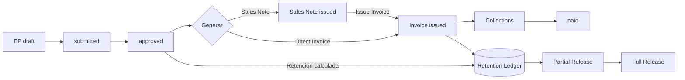

# Estados de Pago (EP) - Módulo Cliente

Este documento describe el modelo de datos, flujo, endpoints y validaciones para el módulo de Estados de Pago (EP) de clientes. Complementa la capa financiera y genera la base de la integración de facturación (AR) y cashflow.

## Objetivos

- Registrar avances de contrato por período (EP) con granularidad de ítems SOV.
- Validar contra topes de contrato (SOV / line_total por item_code).
- Calcular montos netos descontando retenciones y otras deducciones.
- Generar facturas de venta (AR) a partir de EP aprobados.
- Seguir cobranza (collections) y alimentar vistas de cashflow: aprobado (v_ep_approved_project), esperado (v_ar_expected_project), real (v_ar_actual_project).
- Gestionar retenciones retenidas y liberaciones futuras.

## Modelo de Datos (Tablas principales)

| Tabla | Propósito | Claves / Notas |
|-------|-----------|----------------|
| `client_contracts` | Contratos por proyecto-cliente | `retention_pct` default, `payment_terms_days` |
| `client_sov_items` | Ítems de Statement Of Values | UNIQUE `(contract_id,item_code)` |
| `ep_headers` | Encabezado EP | Estado: `draft, submitted, approved, invoiced, paid` |
| `ep_lines` | Líneas EP (monto periodo + acumulado opcional) | Referencia opcional a SOV via `item_code` |
| `ep_deductions` | Deducciones (retention, advance_amortization, penalty, other) | Validación de tipos |
| `ep_files` | Archivos soportes (xlsx/pdf) | Traza de importaciones y adjuntos |
| `ar_invoices` | Facturas AR generadas por EP | `status: issued, paid, cancelled` |
| `ar_collections` | Cobros / pagos recibidos | Suma válida no superar `amount_total` |
| `ep_import_staging` | Staging de importación | Guarda JSON crudo + mapping + validaciones |
| `ep_retention_ledger` | Ledger de retenciones retenidas/liberadas | `released_at` NULL => retenido vigente |

### Vistas de soporte

- `v_ep_approved_project`: Monto neto aprobado por mes (EP aprobados / invoiced / paid).
- `v_ar_expected_project`: Ingresos esperados (facturas emitidas menos cobrado) por mes.
- `v_ar_actual_project`: Cobros efectivos por mes.

## Flujo de Estados

```text
draft -> submitted -> approved -> invoiced -> paid
             ^            |            |
             |            +-- reject?  +-- cancel invoice (opcional futuro)
```

### Flujo extendido con Nota de Venta y Retención



## Endpoints Principales

### EP CRUD / Operaciones

| Método | Ruta | Descripción |
|--------|------|-------------|
| GET | `/api/projects/<pid>/ep` | Listar EP de un proyecto (totales básicos) |
| POST | `/api/ep` | Crear header EP (draft) |
| GET | `/api/ep/<ep_id>` | Obtener header + líneas + deducciones |
| PUT | `/api/ep/<ep_id>` | Actualizar campos editables header |
| POST | `/api/ep/<ep_id>/lines/bulk` | Reemplazar líneas (valida SOV) |
| POST | `/api/ep/<ep_id>/deductions/bulk` | Reemplazar deducciones |
| GET | `/api/ep/<ep_id>/summary` | Totales + retención sugerida |
| POST | `/api/ep/<ep_id>/approve` | Aprobar EP (draft/submitted) |
| POST | `/api/ep/<ep_id>/generate-invoice` | Generar factura (valida duplicado, monto > 0) |
| POST | `/api/ep/<ep_id>/files` | Adjuntar soporte (xlsx/pdf) |

### Contrato & SOV

| Método | Ruta | Descripción |
|--------|------|-------------|
| POST | `/api/contracts` | Crear contrato cliente |
| POST | `/api/contracts/<cid>/sov/import` | Carga masiva SOV |

### AR / Cobranza

| Método | Ruta | Descripción |
|--------|------|-------------|
| POST | `/api/ar/invoices/<inv_id>/collect` | Registrar colección (over_collected guard) |

### Import Staging

| Método | Ruta | Descripción |
|--------|------|-------------|
| POST | `/api/ep/import/staging` | Crear staging (detecta mapping heurístico) |
| POST | `/api/ep/import/staging/<id>/validate` | Validar y obtener violaciones |
| POST | `/api/ep/import/staging/<id>/promote` | Crear EP definitivo desde staging |

### Retención (Próximo / Parcial)

| Método | Ruta | Descripción |
|--------|------|-------------|
| POST | `/api/ep/<ep_id>/retention/release` | Liberar parcial o total (multi‑entrada ledger) |

### Nota de Venta (Sales Note)

| Método | Ruta | Descripción |
|--------|------|-------------|
| POST | `/api/ep/<ep_id>/generate-sales-note` | Genera la nota de venta (snapshot de montos) |
| GET | `/api/sales-notes/<sid>` | Obtiene la nota de venta |
| POST | `/api/sales-notes/<sid>/cancel` | Cancela nota (si no facturada) |
| POST | `/api/sales-notes/<sid>/issue-invoice` | Emite factura desde la nota |

## Validaciones 422

| Código | Descripción |
|--------|-------------|
| `invalid_payload` | Faltan campos requeridos / tipo incorrecto |
| `not_found` | EP o recurso inexistente |
| `ep_exceeds_contract_item` | Línea EP supera cap SOV acumulado |
| `invalid_state` | Transición de estado inválida |
| `duplicate_invoice` | Ya existe invoice para el EP |
| `sales_note_exists` | Nota de venta vigente ya existe |
| `sales_note_invoiced` | Nota ya convertida en factura |
| `sales_note_cancelled` | Nota cancelada para esa acción |
| `zero_amount_invoice` | Neto EP = 0 al intentar factura |
| `over_collected` | Cobro supera saldo de factura |
| `violations_present` | Staging con violaciones no resueltas |

## Cálculo de Totales EP

1. `lines_subtotal = SUM(ep_lines.amount_period)`
2. `deductions_total = SUM(ep_deductions.amount)` agrupado por `type`.
3. `retention_computed = lines_subtotal * retention_pct` (si header.retention_pct y no existe deducción explícita `retention`).
4. `amount_net = lines_subtotal - deductions_total` (no negativo).

## Estrategia de Retención

- Se puede registrar como deducción explícita tipo `retention` o dejar que se calcule sugerencia (`retention_computed`).
- Ledger (`ep_retention_ledger`) permitirá traza: una fila por retención retenida y fecha de liberación (`released_at`).
- Recomendado: al generar factura crear asiento en ledger (pendiente de endpoint release final).

## Import Staging: Heurística de Mapping

Busca en encabezados (lowercase) coincidencias parciales:

- `codigo`, `item`, `code` → `item_code`
- prefijo `desc` o `descripcion` → `description`
- `unidad`, `unit` → `unit`
- prefijo `cant` o `qty` → `qty_period`
- `precio`, `unit_price` → `unit_price`
- `monto`, `amount`, `total` → `amount_period`
- `capitulo`, `chapter` → `chapter`

El usuario puede sobre-escribir enviando `column_map`.

## Cashflow y Métricas Integradas

- `approved_net`: suma neta EP aprobados (pendientes o facturados/pagados) → vista de avance comercial.
- `pending_invoice`: subtotal aprobado aún no facturado.
- `expected_inflow`: facturas emitidas menos cobrado (AR expected) por mes.
- `actual_collections`: cobros reales registrados.

## Ejemplos cURL Básicos

```bash
# Crear contrato
curl -X POST http://localhost:5555/api/contracts -H 'Content-Type: application/json' \
  -d '{"project_id":1,"customer_id":10,"code":"C-001","retention_pct":0.05}'

# Import staging
curl -X POST http://localhost:5555/api/ep/import/staging -H 'Content-Type: application/json' \
  -d '{"project_id":1, "rows":[{"Codigo":"IT-1","Cantidad":10,"Precio":1000}], "infer":true}'

# Validar staging
curl -X POST http://localhost:5555/api/ep/import/staging/5/validate -H 'Content-Type: application/json' -d '{}'

# Promover staging -> EP
curl -X POST http://localhost:5555/api/ep/import/staging/5/promote -H 'Content-Type: application/json' -d '{"header":{"ep_number":"EP-05"}}'

# Aprobar EP
curl -X POST http://localhost:5555/api/ep/12/approve -H 'Content-Type: application/json'

# Generar factura desde EP
curl -X POST http://localhost:5555/api/ep/12/generate-invoice -H 'Content-Type: application/json'

# Registrar cobranza
curl -X POST http://localhost:5555/api/ar/invoices/7/collect -H 'Content-Type: application/json' -d '{"amount":500000}'
```

## Próximos Incrementos Sugeridos

- Endpoint de release de retención con soporte parcial.
- Filtros y paginación en listado EP.
- Exportación XLSX de un EP consolidado.
- Integración de alertas de riesgo por sobre‑avances vs curva planeada.
- Auditoría (tabla de eventos EP).

---
_Última actualización_: (se actualiza automáticamente al cerrar feature)  

